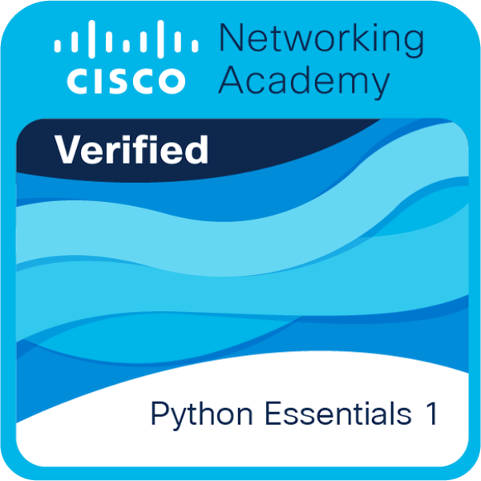

# 🚀 AI/ML Arc 2025  

This repository tracks my journey into **AI/ML from scratch**.  
I’m building with **backend logic, emotional discipline, and freelancing readiness**.  

---

## 📅 Progress Log  

### ✅ Day 1  
- Uploaded vote checker script  
- Practiced input/output and if-else logic  
- Started building emotional discipline through code  

### ✅ Day 2  
- Practiced Python basics (loops, functions, dictionaries)  
- Uploaded initial practice scripts into local repo  

### ✅ Day 3–4  
- Completed **FreeCodeCamp Python Course (4.5 hrs)**  
- Learned project structuring and GitHub basics  
- Started first **mini-project (Calculator)** → moved to separate `python-mini-projects` repo  

---

## 📂 Project Repositories  

🔗 [Python Mini Projects Repo](https://github.com/MelbinMani/python-mini-projects)  
- Calculator  
- To-Do List  
- File Organizer  
- Number Guessing Game  

👉 All projects are gradually built here to strengthen my GitHub portfolio.

---

## 📜 Certificates  

1. **Python Essentials 1 – Cisco/NSDC**  
     
   [📄 View Certificate (PDF)](Certificates/Python_Essentials1_NSDC_Certificate.pdf)  

---

## 🎯 Goals  

- ₹25K–₹30K freelance income by **Jan 2026**  
- ₹10–₹12 LPA remote job by **July 2026**  
- Long-term scaling into **₹30L+ AI/ML mastery**

---

⚡ *Execution > Noise. This repo is proof of small consistent steps → projects → income → freedom.*
